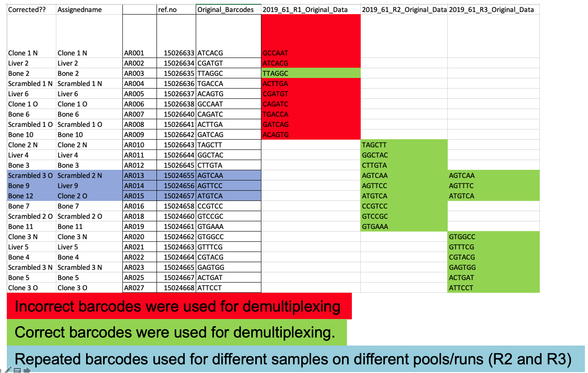

<!-- \begin{center} -->
<!-- Redmine issue:              `r params$redmine_issue` -->

<!-- NBIS staff:                 `r params$staff_name`   -->

<!-- Request by:                 `r params$requester_name`   -->

<!-- Principal investigator:     `r params$pi_name`   -->

<!-- Organisation:               `r params$organisation`   -->


<!-- \end{center} -->
<!-- \newpage -->

\begin{center}

  \begin{tabular}{l r}
    Redmine issue: & `r params$redmine_issue` \\
    NBIS staff: & `r params$staff_name` (`r params$staff_mail`) \\
    Principal investigator: & `r params$pi_name`(`r params$pi_mail`) \\
    Request by: & `r params$requester_name`(`r params$requester_mail`) \\
    Organisation: & `r params$organisation` \\
    Estimated time: & `r params$estimated_time`   \\
    Used time: & `r params$used_time`

  \end{tabular}
\end{center}
\newpage
\tableofcontents 
\newpage

```{r libraries, echo = FALSE}
library(ggplot2)
library(reshape2)
library(knitr)
```

```{r Setup, echo = FALSE}
knitr::opts_chunk$set(fig.width  = 12,
                      fig.height = 8,
                      results    = "asis",
                      message    = FALSE,
                      warning    = FALSE)
```

```{r Report variables, echo = FALSE}
affil <- paste("National Bioinformatics Infrastructure Sweden, Science for",
    "Life Laboratory, Stockholm University")
link_support <- "http://nbis.se/support/support.html"
link_uppmax <- paste("http://uppmax.uu.se/support-sv/faq/general-",
    "miscellaneous-faq/acknowledging-uppmax--snic--and-uppnex")
link_authorship <- "http://www.icmje.org/recommendations/"
link_agreement <- "http://nbis.se/assets/doc/nbis-support-useragreement.pdf"
link_acknowledge <- paste("https://ngisweden.scilifelab.se/info/faq#how-do",
                          "-i-acknowledge-ngi-in-my-publication")
link_sensitive_data <- "https://nbis.se/support/human-data.html"
```

# Work log
The aim of this project is to investigate the effect of miRNA-379 on gene expression profile of prostate cancer in different metastatic environments both in in-vitro (regular cell media and osteoblast conditioned medium) as well as in-vivo (mouse liver and bone). 
 

 * **2019-09-06:** Meeting with the group to plan the data analysis  
 
 * **2019-10-31:** Giving update about QC and trimming of the data as well as selection of samples to test the pipeline   
 
 * **2019-12-02:** Giving feedback about high multimapped reads in the tested samples  
 
 * **2020-01-22:** Selecting samples with RIN value > 5  
 
 * **2020-03-27:** Reporting analysis based on a new pipeline (GSNAP + Disambiguate/XenofilteR)  
 
 * **2020-04-03:** Suggesting to check the barcodes used during demultiplexing and asking sequencing platform to provide bcl files generated by sequencing machine  
 
 * **2020-08-27:** Confirming errors in used barcodes  
 
 * **2020-10-09:** Reporting on the progress and comparison with another prostate cancer cell line from Jividen et al 2018.
 
 * **2020-10-09:** The group confirmed species specific amplification in selected number of samples by qRT-PCR  
 
 * **2020-12-18:** Improving the pipeline to generate better mapping and resolving reads clipping issue; This was done by using XenofilteR 
 
* **2021-01-28:** Internal meeting with colleagues at NBIS. Based on the discussions additional analyses were performed.  

* **2021-03-03:** Last meeting; we decided to present all the observations in a report. 

\newpage

# Practical information  
## Data responsibilities
Unfortunately, NBIS does not have resources to keep any files associated with
the support request; we kindly suggest that you safely store the results
delivered by us. In addition, we kindly ask that you remove the files from
UPPMAX/UPPNEX. The main storage at UPPNEX is optimized for high-speed and
parallel access, which makes it expensive and not the right place for long-term
archiving. Please be considerate of your fellow researchers by not taking up
this expensive space.

The responsibility for data archiving lies with universities and we recommend
asking your local IT for support with long-term data storage. The
[Data Center](https://www.scilifelab.se/data/) at SciLifeLab may also be
of help with discussing other options.

Please note that special considerations may apply to human-derived, sensitive
personal data. This should be handled according to specific laws and
regulations as outlined at the [NBIS website](`r link_sensitive_data`).

## Acknowledgements
If you are presenting the results in a paper, at a workshop or at a conference,
we kindly remind you to acknowledge us according to the signed
[NBIS User Agreement](`r link_agreement`):

[NBIS staff should be included as co-authors](`r params$staff_web`) if the
support work leads to a publication and when this is merited in accordance to
the ethical recommendations for authorship, *i.e.* the [ICMJE
recommendations](`r link_authorship`). If applicable, please include
*`r params$staff_name`, `r affil`* as co-author. If the above is not
applicable, please acknowledge NBIS like so: *Support by NBIS (National
Bioinformatics Infrastructure Sweden) is gratefully acknowledged.*

In addition, Uppmax kindly asks you to [acknowledge UPPMAX and
SNIC](`r link_uppmax`). If applicable, please add: *The computations were
performed on resources provided by SNIC through Uppsala Multidisciplinary
Center for Advanced Computational Science (UPPMAX) under Project
`r params$uppmax_project`.*

In any and all publications based on data from NGI Sweden, the authors
must [acknowledge SciLifeLab, NGI and Uppmax](`r link_acknowledge`), like so:
*The authors would like to acknowledge support from Science for Life
Laboratory, the National Genomics Infrastructure, NGI, and Uppmax for providing
assistance in massive parallel sequencing and computational infrastructure.*

## Closing procedures
You should soon be contacted by one of our managers, Jessica Lindvall
*(jessica.lindvall@nbis.se)* or Henrik Lantz
*(henrik.lantz@nbis.se)*, with a request to close down the project in our
internal system and for invoicing matters. If we do not hear from you within
**30 days** the project will be automatically closed and invoice sent.
Again, we would like to remind you about data responsibility and
acknowledgements, see the sections on data responsibilities and
acknowledgments.

You are naturally more than welcome to come back to us with further data
analysis request at any time via [the support form](`r link_support`). Thank
you for using NBIS, we wish you the best of luck with your future research!


# Methods
In this project we tested different pipelines and here we only present the pipeline showed the most reliable results.   

## Genome preparation  
We used human genome reference (GRCh38) on Uppmax and downloaded the annotation from gencode (version32). We downloaded mouse (BALB_CJ) genome and annotation from Sanger institute (https://www.sanger.ac.uk/data/mouse-genomes-project/ downloaded 2019Nov).  We indexed the genomes by  gmap_build from GSNAP[@Wu2010].  

## QC (00-QC)  
We checked quality of the reads by using FastQC [@Andrews] and merged the results by MultiQC[@Ewels2016]. For rRNA contamination we used bbduk from BBMap (version 38.61) [@osti_1241166].  

## Trimming 
By using trimmomatic[@Bolger2014] we trimmed the adapters and filtered out low quality reads. We kept reads that both pairs survived trimming and filtering.  

## Alignment (01-BAM)
We aligned trimmed reads on human and mouse genome by STAR[@Dobin2012] and GSNAP[@Wu2010]. We first evaluated the aligners and the results showed that GSNAP had a better performance Thus, all the results provided here is based on GSNAP alignment. To select species specific reads, we used Disambiguate  [@Ahdesmaki2017] and XenofilteR[@Kluin2018] tools. These tools assign reads to corresponding species based on edit distance. We evaluated performance of these tools and XenofilteR could rescue more accurate alignments. 

## Post-alignment QC (02-Post-alignment-QC) 
We evaluated number of metrics after alignment by using QoRTs[@Hartley2015]. We checked the frequency of clipping, drop rate, gene-body coverage, and other metrics.      

## Expression analysis  (03-Expression) 
We extracted fragment counts of all genes by using featurecounts[@Liao2014]. We used reads with mapping quality +20 and pairs that are properly mapped on the same chromosome. For normalization and downstream analysis we used edgeR[@Robinson2009]. 

All the downstream analysis and visualization are done in R (version 4).

\newpage
# Results
Figure \@ref(fig:samples) shows the study design and 27 samples used to generate RNA-seq data.  
```{r samples, out.width = "85%", fig.align="center", fig.cap = "Study design and samples used in this experiment.", echo = F, crop = F}

include_graphics("../../results/Samples.png")
```

\newpage
Table \@ref(tab:samples-read) shows the number of reads survived the filtering and adapter removal.  
```{r samples-read, echo = F}
library(captioner)

library(kableExtra)
library(dplyr)
library(kableExtra)
all_samples <- data.frame(Sample = c("Bone10", "Bone11", "Bone12", "Bone2", "Bone3", "Bone4", "Bone5", "Bone6", "Bone7", "Bone9", "Clone1N", "Clone1o", "Clone2N", "Clone2o", "Clone3N", "Clone3o", "Scr1N", "Scr1o", "Scr2N", "Scr2o", "Scr3N", "Scr3o", "liver2", "liver4", "liver5", "liver6", "liver9"),
                          Trimmed_paired_reads = c(81102733, 37971567, 53948391, 78067329, 47754989, 57020540, 53046795, 47358187, 27381663, 34191583, 55121667, 32982410, 69161719, 11959763, 42989660, 26328827, 44153614, 48000823, 52635168, 49678746, 53050567, 68393743, 45037303, 87073897, 84114465, 57720097, 84363395) )
kable(all_samples, booktabs = T, caption = 'Summary of sequencing data; Number of trimmed reads.')

```

## QC 
### FastQC
The QC results is available in  
_/crex/proj/snic2019-30-25/private/UserDirectories/SMS_4882_19_Prostate_Bulk_RNA_Seq/results/00-QC/_  
By MultiQC we summarized all the fastqc results. The duplication rate is high in the raw reads (Figure \@ref(fig:multiqc-duplicate)).  Also, GC content seems to be shifted and a bit noisy (Figure \@ref(fig:multiqc-gc-content)). These figures together with other statistics are available in multiqc report saved under QC folder.
```{r multiqc-duplicate, out.width = "85%", fig.align="center", fig.cap = "Fraction of duplicate reads.", echo = F, crop = F}


```


```{r multiqc-gc-content, out.width = "85%", fig.align="center", fig.cap = "GC content across all samples.", echo = F, crop = F}


```
\newpage
### rRNA contamination
We checked the data for presence of rRNA in the data by bbduk. All the rRNA sequences of both genomes were extracted from the annotation files. The contamination level was very low (0-0.07%). The results are available in   
_/crex/proj/snic2019-30-25/private/UserDirectories/SMS_4882_19_Prostate_Bulk_RNA_Seq/results/00-QC/_
  
### Barcodes 
During the analysis we noticed an inconsistency between barcodes used for demultiplexing/sequencing procedure and barcodes used in the lab. Figure \@ref(fig:barcodes) indicates that almost all the barcodes in pool1 are shuffled. In following results 17 samples used from which 5 are from pool1 (Clone1N, liver2, Clone1o, Scr1o, Bone10). Only Bone2 seems to have the correct barcode. 

```{r barcodes, out.width = "85%", fig.align="center", fig.cap = "List of barcodes and samples in groupes in three pools.", echo = F, crop = F}


```

## Trimming
By using Trimmomatic, we kept reads that both pairs survived the trimming and reads with +36 bases length. Also, we removed adapter sequences from the reads. Trimmed reads are located in   
_/crex/proj/snic2019-30-25/private/UserDirectories/SMS_4882_19_Prostate_Bulk_RNA_Seq/data/Trimmed-reads/_ 

Also FastQC of the trimmed reads are located in  
_/crex/proj/snic2019-30-25/private/UserDirectories/SMS_4882_19_Prostate_Bulk_RNA_Seq/results/00-QC/FastQC_Trimmed/_  
 

## Alignment and Post-alignment QC  
We first aligned the reads on BALB_CJ and human genome separately. Then, we used XenofilteR with  default values. This tool assigns the reads to corresponding genome based on edit distance. Reads with smaller number of mismatches will be assigned. By using this method we could rescue reads with more reliable alignments and improve clipping rate of the reads. In original mappings, aligners clipped edges of the reads in order to find a better match on the genome. This resulted into mapping of shorter sequences on multiple location which in turn increases multi-maping rate in the alignment and we observed this issue in this dataset. Thus, it is important that reads be assigned to correct target and by using XenofilteR we could significantly improve this metric (Figure \@ref(fig:clipping)).  

```{r clipping, out.width = "85%", fig.cap = "Clipping rate of reads left: V shape line shows a lot of clipping at the edges while U shape is more expected with lower rate at the edges. By using XenofilteR reads, with more reliable alignment to corresponding genomes, were rescued with significant improvement in clipping rate.", echo = F, crop = F}

include_graphics("../../results/02-Post-alignment-QC/Clipping_genome_Xenofilter.png")
```

All the bam files are in  
_/crex/proj/snic2019-30-25/private/UserDirectories/SMS_4882_19_Prostate_Bulk_RNA_Seq/results/01-BAM/_    


## Expression analysis  
We extracted expression values of all the genes in annotation files by using featurecounts. After extracting the expression values we normalized the data and generated TMM values (trimmed mean of M-values) by edgeR to check overall expression pattern among all the samples. In addition to this dataset, we analyzed three PC3 cell line samples from Jividen et al. 2018[@Jividen2018] (SRR7943936, SRR7943937, SRR7943938; all the generated bam files and expression values of these samples are saved together with the dataset in this project.).      

Figure \@ref(fig:mds) shows clustering of the samples. Test samples tend to cluster together while all other samples are scattered both in the alignment on human and BALB_CJ genome. Mouse tissues tend to have a better clustering in the alignment on BALB_CJ genome which is expected except liver2 (liver2 is one of the samples from pool1 with inconsistent barcode).  

```{r mds, out.width = "85%", fig.cap = "Multidimensional scaling (MDS) plot showing biological variation among samples (Left: human right: BALBCJ) .", echo = F}


```
\newpage

We also checked the expression distribution of genes in all the samples. Figure \@ref(fig:exprhuman) and \@ref(fig:exprbalbcj) shows expression values distribution in human and BALB_CJ, respectively. Two genes were used to validate species specific expression that are highlighted in these figures; GUSB (blue) and PGK1 (red). qRT-PCR confirms species specific expression in selected number of samples while in some of the samples here we see inconsistent pattern and it is due to the barcodes issue highlighted before.    


```{r exprhuman, out.width = "85%", fig.align="center", fig.cap = "Expression distribution of genes in human genome across all samples. GUSB (blue), PGK1(red).", echo = F}

 
```

```{r exprbalbcj, out.width = "85%", fig.align="center", fig.cap = "Expression distribution of genes in BALBCJ genome across all samples. GUSB (blue), PGK1(red).", echo = F}

include_graphics("../../results/03-Expression/featurecounts/XenofilteR/GSNAP_BALB_CJ/Normalized_expression_dist_BALB_CJ_with_test.png") 
```


\newpage
Moreover, by looking into fraction of  reads that were used for quantification of the genes or expression analysis is quite small (Figure \@ref(fig:assignmentfraction)).  Mouse tissues show high fraction of reads assigned to mouse (BALB_CJ) features (genes) compared to human. Unexpectedly, this fraction is quite small in both genomes for human cell lines samples.  

```{r assignmentfraction, out.width = "85%", fig.align="center", fig.cap = "Fraction of reads assigned to features (genes) in both genomes.", echo = F}
 
```

\newpage
# Concluding remarks
The pipeline implemented in this project has improved the assignment of the reads to two different genomes (BALB_CJ and human). Issues hindering the downstream analysis in this project are:  

- Shifted and a bit noisy distribution of GC-content.  

- High rate of duplicated reads.  

- Swapped barcodes which has affected samples in pool1. This also resulted in inconsistency between RNA-seq data and qRT-PCR results.  

- High rate of multimapped reads which is result of high rate of duplicated reads.  

- Highlighted issues has reflected in dispersed clustering of the samples.  

- Quite varilable fraction of reads assigned to features in both genomes. It was mostly evident in human cell-line samples.   


The downstream analysis and interpretation of the results are subjected to bias because of unexpected features observed in the data. Thus, by this report we have summarized the analysis pipeline and QC metrics used to evaluate the data.  All the scripts, this report, and results are available on Uppmax:  
_/crex/proj/snic2019-30-25/private/UserDirectories/SMS_4882_19_Prostate_Bulk_RNA_Seq/_  

Also you can find scripts and this report and results (except bam files) on github:  
https://github.com/NBISweden/SMS_4882_19_Prostate_Bulk_RNA_Seq

Scripts are under _code_ directory:  
GSNA_BALB_CJ/generate-commands.sh for alignment of reads on BALB_CJ genome.  
GSNA_Human/generate-commands.sh for alignment of reads on human genome  

\newpage

# Reproducibility  
List of tools and packages used in this project:  
- FastQC 0.11.9  
- MultiQC  1.9  
- Trimmomatic 0.36  
- STAR 2.7.2b  
- GSNAP gmap-gsnap/2017-09-11   
- samtools 1.10  
- QoRTs 1.3.6  
- StringTie 2.1.4  
- featureCounts 2.0.0  
- Disambiguate 1.0  
- XenofilteR 0.0.99  
Matrix products: default BLAS: /Library/Frameworks/R.framework/Versions/4.0/Resources/lib/libRblas.dylib LAPACK: /Library/Frameworks/R.framework/Versions/4.0/Resources/lib/libRlapack.dylib  
locale: [1] sv_SE.UTF-8/sv_SE.UTF-8/sv_SE.UTF-8/C/sv_SE.UTF-8/sv_SE.UTF-8 attached base packages:   
[1] stats graphics grDevices utils datasets methods base  
other attached packages: [1] dplyr_1.0.3 kableExtra_1.3.1 captioner_2.2.3 knitr_1.31 [5] reshape2_1.4.4 edgeR_3.32.1 limma_3.46.0 ggplot2_3.3.3  
loaded via a namespace (and not attached):  
[1] Rcpp_1.0.6 plyr_1.8.6 pillar_1.4.7 compiler_4.0.3 [5] tools_4.0.3 digest_0.6.27 viridisLite_0.3.0 evaluate_0.14
[9] lifecycle_0.2.0 tibble_3.0.6 gtable_0.3.0 lattice_0.20-41  
[13] pkgconfig_2.0.3 rlang_0.4.10 rstudioapi_0.13 yaml_2.2.1  
[17] xfun_0.20 xml2_1.3.2 httr_1.4.2 withr_2.4.1  
[21] stringr_1.4.0 generics_0.1.0 vctrs_0.3.6 webshot_0.5.2  
[25] locfit_1.5-9.4 grid_4.0.3 tidyselect_1.1.0 glue_1.4.2   
[29] R6_2.5.0 rmarkdown_2.7 bookdown_0.21 purrr_0.3.4  
[33] magrittr_2.0.1 scales_1.1.1 ellipsis_0.3.1 htmltools_0.5.1.1 [37] rvest_0.3.6 colorspace_2.0-0 stringi_1.5.3 munsell_0.5.0  
[41] crayon_1.3.4  

# Reference  
